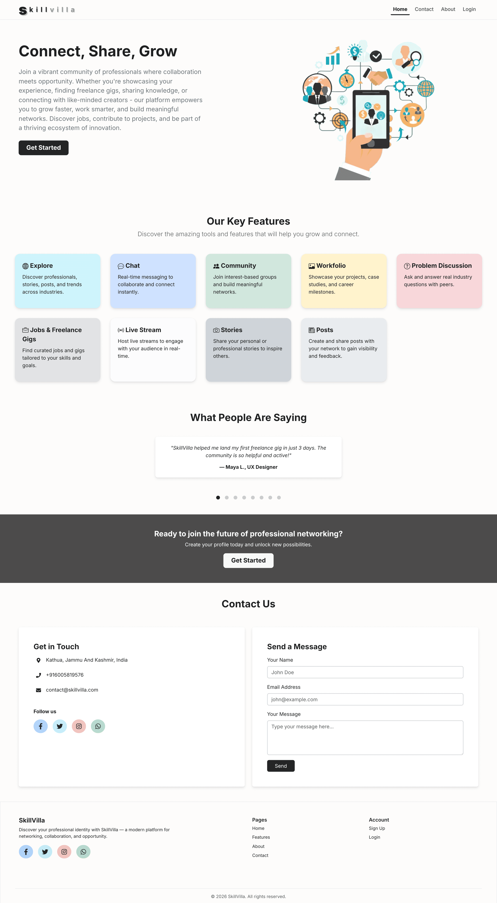
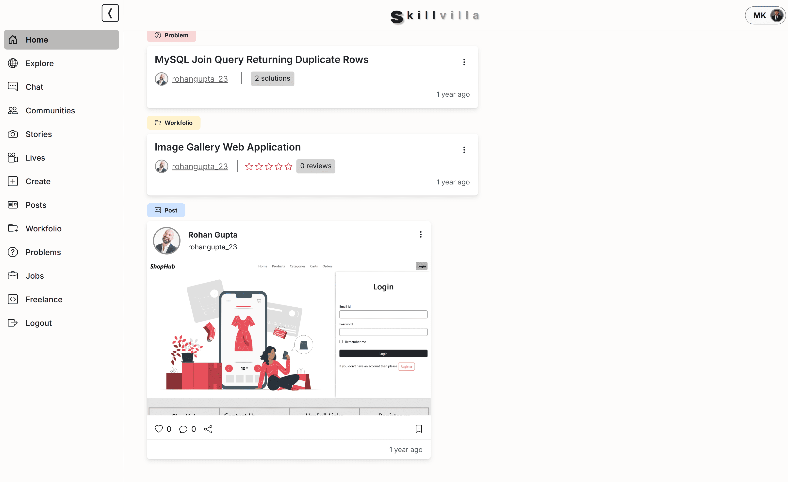
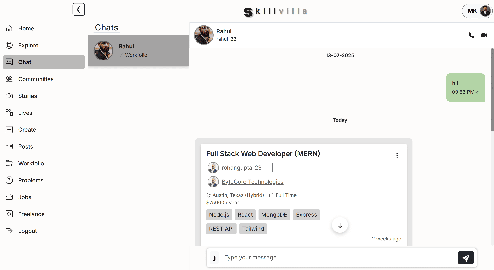
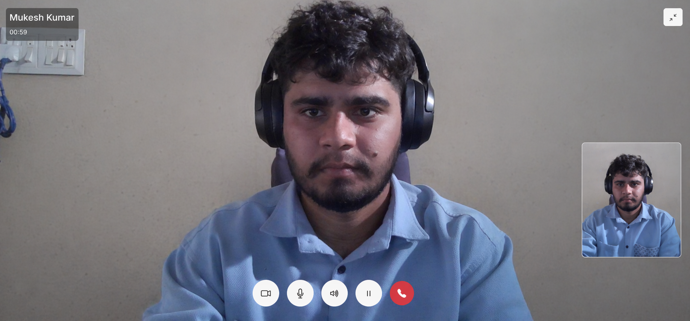
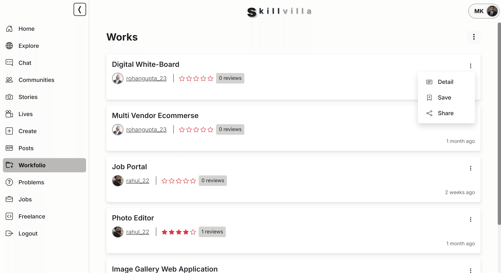
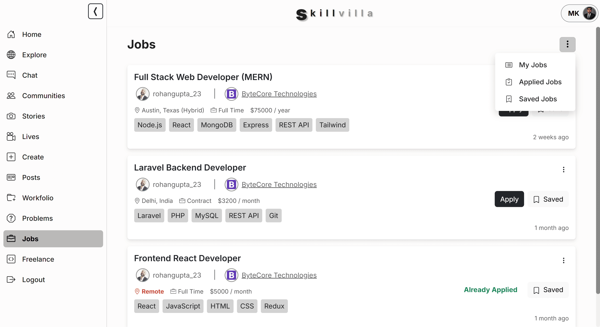
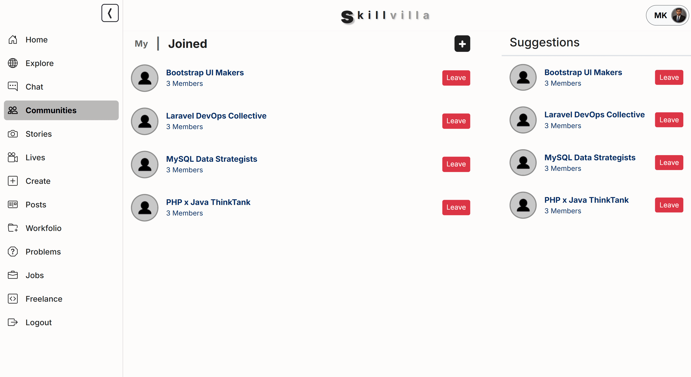
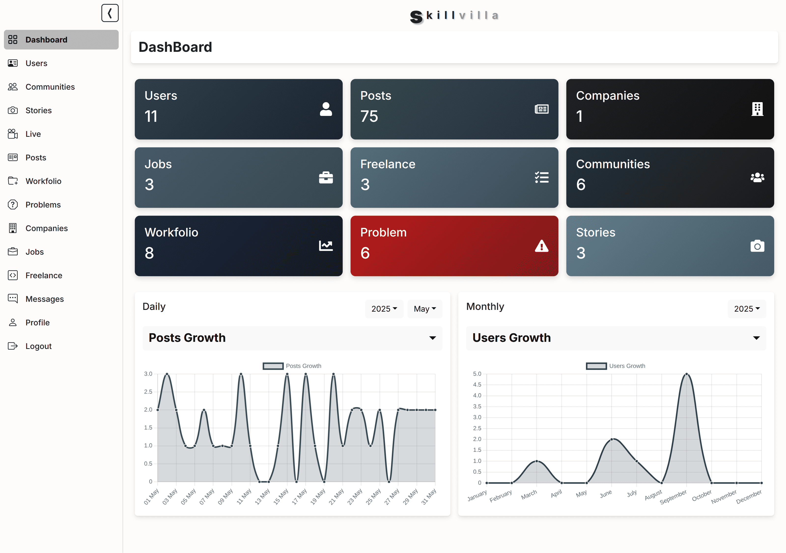
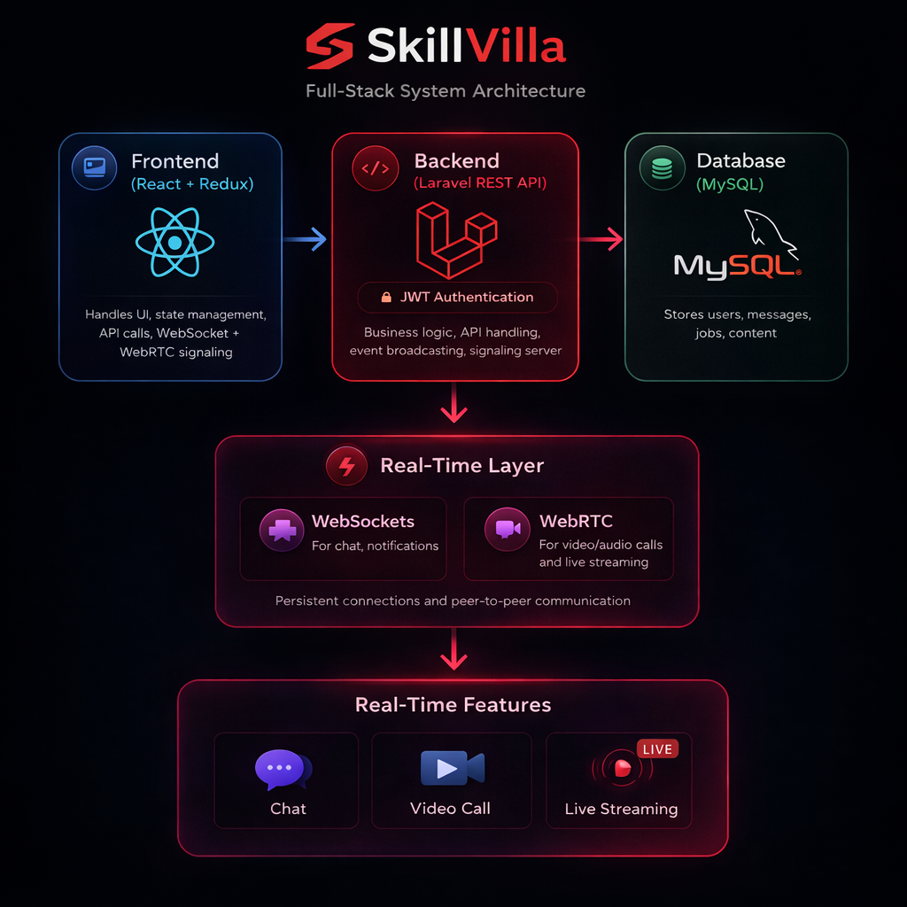

# SkillVilla — Professional Media Platform

SkillVilla is a full-stack professional media platform that combines professional networking, freelance workflows, job discovery, content sharing, and real-time communication into a unified ecosystem.

The platform was designed to reduce fragmentation across professional workflows by allowing users to showcase work, connect with communities, discover opportunities, and communicate in real time without switching between multiple systems.

> Built independently as a complete end-to-end full-stack system.

---

## 🌐 Live Demo

🔗 Demo: http://52.53.160.90/

### Demo Credentials

```txt
Email: thappamkkumar@gmail.com
Password: Mukesh;06
```

You can also create a new account.

---

## 📸 Screenshots

### Landing page


### Feed System


### Real-Time Chat


### Video Calling


### Workfolio


### Jobs & Freelance


### Communities


### Admin Dashboard


---

## 🧠 Architecture Diagram

<p align="center">
  
</p>

---

## 🚀 Core Features

### Professional Platform
- Authentication & profile system
- Follow/unfollow system
- Workfolio showcase with reviews & ratings
- Community creation and management

### Content & Discovery
- Posts and discussions
- Problem-solving system
- Jobs and freelance gigs
- Unified search and explore system
- Infinite scroll feed architecture

### Real-Time Communication
- Private and community chat
- Message and story seen status
- Real-time likes, comments, and interactions
- Audio/video calling using WebRTC
- Live streaming system

### Administration
- Admin dashboard
- User and content management
- Platform moderation tools

---

## 🏗️ Project Overview

SkillVilla is a unified professional ecosystem designed to integrate networking, communication, content sharing, freelance workflows, and job discovery into a single platform.

The system focuses on creating a consistent user experience where professionals can interact, showcase work, participate in communities, and access opportunities without relying on multiple disconnected applications.

---

## 🧠 System Architecture

SkillVilla follows a monolithic full-stack architecture extended with real-time communication layers.

### Frontend
- React.js
- Redux Toolkit
- Bootstrap
- Vite

### Backend
- Laravel 11
- REST APIs
- JWT Authentication
- Laravel Reverb

### Real-Time Layer
- WebSockets
- Laravel Echo
- WebRTC

### Database
- MySQL relational database

### Deployment
- AWS EC2
- Ubuntu
- Nginx
- Queue Workers

---

## ⚙️ Tech Stack

### Frontend
- React 18
- Redux Toolkit
- React Router
- Bootstrap 5
- Axios
- Styled Components
- Chart.js
- Quill Editor
- Vite

### Backend
- Laravel 11
- PHP 8.2
- JWT Authentication
- Laravel Reverb
- REST APIs

### Database
- MySQL

### Real-Time Technologies
- WebSockets
- Laravel Echo
- WebRTC
- Pusher JS

### Infrastructure
- AWS EC2
- Ubuntu
- Nginx

---

## 🧩 Core Systems

### Content Engine
Unified architecture supporting:
- posts
- jobs
- freelance gigs
- workfolio
- problem discussions

All content types share:
- likes
- comments
- shares
- interaction workflows

---

### Messaging System
Persistent real-time communication system featuring:
- private messaging
- community chat
- live synchronization
- seen status tracking
- message persistence

---

### Feed & Discovery System
Dynamic discovery architecture supporting:
- follow-based feed generation
- categorized exploration
- unified search system
- content discovery flows

---

### Infinite Scroll System
Optimized continuous content loading with:
- offset/limit controlled fetching
- duplicate prevention
- synchronized API requests
- smooth browsing experience

---

## 🧠 Technical Challenges Solved

### Managing Multiple Content Types
Designed a unified interaction architecture while supporting different data structures for posts, jobs, workfolio, and discussions.

### Synchronizing REST APIs with Real-Time Events
Used Redux as a centralized state layer to synchronize API responses with WebSocket events.

### Implementing WebRTC Without Third-Party Calling Services
Used the Laravel backend as a signaling server to exchange SDP and ICE candidates for peer-to-peer communication.

### Infinite Scroll Consistency
Implemented controlled offset/limit fetching to avoid duplicate data, inconsistent ordering, and excessive API calls.

### Managing Large System Complexity
Organized the platform into modular domains and structured APIs by system responsibility.

---

## 📁 Project Structure

```bash
skillvilla/
├── app/
├── bootstrap/
├── config/
├── database/
├── public/
├── resources/
│   ├── js/
│   ├── components/
│   ├── pages/
│   ├── redux/
│   └── layouts/
├── routes/
├── storage/
└── tests/
```

---

## 🛠️ Installation

### Clone Repository

```bash
git clone https://github.com/thappamkkumar/skillvilla.git
```

---

### Backend Setup

```bash
composer install
cp .env.example .env
php artisan key:generate
```

Configure database credentials in `.env`

Run migrations:

```bash
php artisan migrate
```

Start backend server:

```bash
php artisan serve
```

---

### Frontend Setup

Install dependencies:

```bash
npm install
```

Start development server:

```bash
npm run dev
```

---

### Start Real-Time Services

Run Laravel Reverb server:

```bash
php artisan reverb:start
```

Run queue worker:

```bash
php artisan queue:work
```

---

## 🔐 Authentication

- JWT-based authentication
- Protected routes
- Token-based authorization
- Secure API access

---

## 📈 Engineering Highlights

- Independently built end-to-end full-stack architecture
- Integrated WebSockets and WebRTC for real-time systems
- Designed scalable multi-domain application structure
- Managed centralized frontend state using Redux Toolkit
- Built unified interaction workflows across content systems
- Deployed and configured application manually on AWS EC2
- Implemented real-time synchronization across multiple platform features

---

## 📌 Future Improvements

- Redis caching
- Notification system
- Rate limiting
- Media optimization pipeline
- Docker-based deployment
- Advanced recommendation system
- Service separation for real-time infrastructure

---

## 👨‍💻 Author

Mukesh Kumar

- Portfolio: https://mukeshkumar.vercel.app/
- GitHub: https://github.com/thappamkkumar
