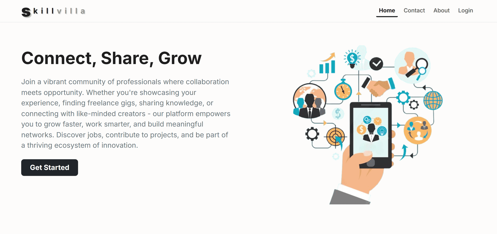

# SkillVilla — Professional Media Platform

SkillVilla is a full-stack professional media platform that combines professional networking, freelance workflows, job discovery, content sharing, and real-time communication into a unified system.

The platform was designed to reduce fragmentation across professional platforms by allowing users to showcase work, connect with others, discover opportunities, and communicate in real time without switching between multiple systems.

> Built independently as a complete end-to-end full-stack system.

---

## 🌐 Live Demo

🔗 Demo: http://52.53.160.90/

### Demo Credentials

```txt
Email: thappamkkumar@gmail.com
Password: Mukesh;06
```

You can also create a new account.

---
## 📸 Screenshots

### Homepage


### Feed System


### Real-Time Chat


### Video Calling


### Workfolio


### Jobs & Freelance


### Communities


---

## 🧠 Architecture Diagram

<p align="center">
  
</p>

---

## 🚀 Core Features

### Professional & Social Features
- User authentication and authorization
- Professional profile system
- Follow/unfollow system
- Workfolio showcase system
- User reviews and ratings
- Story publishing system
- Community creation and management

### Content Systems
- Posts and discussions
- Problem-solving discussion system
- Job listings
- Freelance gigs
- Workfolio uploads
- Shared interaction model for likes, comments, and shares

### Real-Time Systems
- Real-time private messaging
- Community real-time chat
- Message seen status
- Story seen status
- Real-time likes, comments, and shares
- Real-time workfolio reviews
- Real-time problem discussions
- Story commenting system

### Communication Layer
- 1-to-1 audio calls
- 1-to-1 video calls
- Live streaming system
- WebRTC peer-to-peer communication

### Discovery & Search
- Unified explore/search system
- Search across:
  - Users
  - Jobs
  - Freelance gigs
  - Problems
  - Workfolio
  - Communities
  - Content

### Administrative Features
- Admin panel
- Content management
- User management
- Platform moderation tools

---

## 🏗️ Project Overview

SkillVilla was designed as a unified professional ecosystem where users can:
- build professional identity
- showcase skills and work
- communicate in real time
- discover opportunities
- participate in communities
- collaborate through freelance and job systems

Instead of separating these workflows into different platforms, the system integrates them into a single application with a consistent experience and shared interaction model.

---

## 🧠 System Architecture

SkillVilla follows a monolithic full-stack architecture extended with real-time communication layers.

### Frontend Layer
- React.js
- Redux Toolkit
- React Router
- Bootstrap
- Styled Components
- Vite

Responsibilities:
- UI rendering
- State management
- Real-time synchronization
- API integration
- WebRTC signaling handling

### Backend Layer
- Laravel 11
- REST API architecture
- JWT authentication
- Laravel Reverb
- Queue workers

Responsibilities:
- Authentication & authorization
- API handling
- Real-time event broadcasting
- WebRTC signaling
- Business logic management

### Real-Time Layer
- WebSockets using Laravel Reverb & Echo
- WebRTC peer-to-peer communication
- Persistent messaging channels
- Live event broadcasting

### Database Layer
- MySQL relational database
- Structured schema for:
  - users
  - posts
  - jobs
  - messages
  - communities
  - workfolio
  - gigs
  - stories

### Deployment Layer
- AWS EC2
- Ubuntu server
- Nginx configuration
- Queue worker setup
- Full-stack deployment on single instance

---

## ⚙️ Tech Stack

### Frontend
- React 18
- Redux Toolkit
- Bootstrap 5
- Axios
- React Router
- Styled Components
- Chart.js
- Quill Editor
- Vite

### Backend
- Laravel 11
- PHP 8.2
- JWT Authentication
- Laravel Reverb
- REST APIs

### Database
- MySQL

### Real-Time Technologies
- WebSockets
- Laravel Echo
- WebRTC
- Pusher JS

### Deployment & Infrastructure
- AWS EC2
- Ubuntu
- Nginx

---

## 🔄 Real-Time Architecture

The platform combines REST APIs with persistent WebSocket connections.

### REST APIs Handle
- initial data fetching
- authentication
- CRUD operations
- system workflows

### WebSockets Handle
- live messaging
- instant UI synchronization
- activity broadcasting
- live interaction updates

### WebRTC Handles
- audio/video calls
- peer-to-peer communication
- live streaming

The Laravel backend also acts as the signaling server for WebRTC peer connection negotiation.

---

## 🧩 Core Systems

### Content Engine
Unified content architecture supporting:
- posts
- jobs
- freelance gigs
- workfolio
- problems/discussions

All content types share:
- likes
- comments
- shares
- interaction flows

---

### Messaging System
Persistent real-time messaging system featuring:
- private chat
- community chat
- live updates
- message persistence
- seen status tracking

---

### Feed & Discovery System
Dynamic discovery system supporting:
- follow-based feed generation
- content exploration
- unified search
- categorized discovery flows

---

### Infinite Scroll System
Implemented optimized continuous content loading:
- offset/limit controlled fetching
- duplicate prevention
- controlled API synchronization
- optimized browsing experience

---

## 🧠 Technical Challenges Solved

### Managing Multiple Content Types
Designed a unified interaction architecture while supporting different data structures for posts, jobs, workfolio, and discussions.

### Synchronizing REST APIs with Real-Time Events
Used Redux as centralized state management to synchronize API responses with WebSocket events.

### Implementing WebRTC Without Third-Party Calling Services
Used Laravel backend as a signaling server to exchange SDP and ICE candidates for peer-to-peer communication.

### Infinite Scroll Consistency
Implemented controlled offset/limit fetching to avoid:
- duplicate data
- inconsistent ordering
- excessive API calls

### Managing Large System Complexity
Organized the platform into modular domains and structured APIs by system responsibility.

---

## 📁 Project Structure

```bash
skillvilla/
├── app/
├── bootstrap/
├── config/
├── database/
├── public/
├── resources/
│   ├── js/
│   ├── components/
│   ├── pages/
│   ├── redux/
│   └── layouts/
├── routes/
├── storage/
└── tests/
```

---

## 🛠️ Installation

### Clone Repository

```bash
git clone https://github.com/thappamkkumar/skillvilla.git
```

---

### Backend Setup

```bash
composer install
cp .env.example .env
php artisan key:generate
```

Configure database credentials in `.env`

Run migrations:

```bash
php artisan migrate
```

Start backend server:

```bash
php artisan serve
```

---

### Frontend Setup

Install dependencies:

```bash
npm install
```

Start Vite development server:

```bash
npm run dev
```

---

### WebSocket Server

Run Laravel Reverb server:

```bash
php artisan reverb:start
```

---

### Queue Worker

```bash
php artisan queue:work
```

---

## 🔐 Authentication

- JWT-based authentication
- Protected routes
- Token-based authorization
- Secure API access

---

## 📈 Key Engineering Highlights

- Full-stack architecture built independently
- Real-time systems using WebSockets and WebRTC
- Complex multi-domain application structure
- Centralized state management with Redux
- Unified content interaction architecture
- Manual AWS deployment and server configuration
- Real-time synchronization across multiple systems

---

## 📌 Future Improvements

- Redis caching
- Notification system
- Rate limiting
- Media optimization pipeline
- Microservice extraction for real-time layer
- Advanced recommendation system
- Containerized deployment using Docker

---

## 👨‍💻 Author

Mukesh Kumar

- Portfolio: https://mukeshkumar.vercel.app/
- GitHub: https://github.com/thappamkkumar
```
